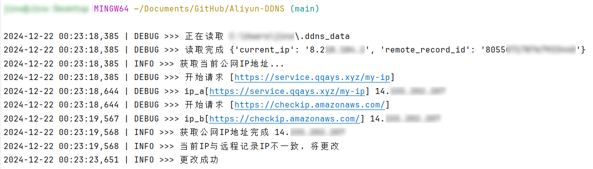

# Aliyun-DDNS

部署在本地的阿里云DDNS更新脚本

## 简介

这是一个由Python编写的阿里云DDNS脚本, 可以自动查询执行脚本机器的当前公网IP并与域名中某个A类主机记录比对。

如执行脚本机器当前公网IP与主机记录值有差异就会进行值更新, 并发送通知邮件。(异常情况也会进行通知)

## 脚本原理

查询DNS记录值: AccessKey ID与AccessKey Secret创建连接请求 -> 使用主机记录查询RecordId -> 使用RecordId查询记录值

查询公网IP: 使用抽样的两个URL进行查询比较，支持多检测URL

## 使用

`main.py` 为集成阿里SDK版本, 需安装Python要求。~~`slim.py` 为模拟了阿里SDK请求, 无外部Python库依赖。~~(`main.py`使用yaml后, `slim.py`将不支持)

1. 克隆项目, 进入项目。

```shell
cd ~
git clone https://github.com/qqAys/Aliyun-DDNS.git
cd Aliyun-DDNS
```

2. 安装Python要求。~~(slim无需执行该步骤)~~

```shell
pip install -r requirements.txt
```

3. 将配置文件重命名, 修改配置。(参见`config.example.yml`)

```shell
mv config.example.yml config.yml
```

4. 使用`crontab -e`添加定时执行。

   - 使用 `main.py`, 可指定参数`-c`或`--config_file`, 其他参数参见`-h`
   
       ```shell
       */10 * * * * /usr/bin/bash -c 'python3 ~/Aliyun-DDNS/main.py >> ~/.ddns_log 2>&1'
       # 或者指定配置文件路径参数
       */10 * * * * /usr/bin/bash -c 'python3 ~/Aliyun-DDNS/main.py -c ~/Aliyun-DDNS/config.yml >> ~/.ddns_log 2>&1'
       ```

   - ~~使用 `slim.py`~~(`main.py`使用yaml后, `slim.py`将不支持)

## 截图



## 相关链接

[阿里云-RAM访问控制-创建AccessKey](https://ram.console.aliyun.com/manage/ak)

[阿里云-云解析-API](https://next.api.aliyun.com/api/Alidns/2015-01-09)
